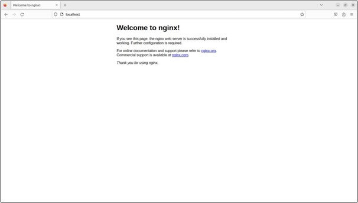

目次  
1. ローカル環境でのCentOS立ち上げ
   1. [ローカルPCセットアップ](./1_vagrant-setting.md)

2. Wordpress導入のためのOS/MW/SW準備
   1. [OSユーザー作成/公開鍵認証設定](./2-1_ssh-setting.md)
   2. [Nginxの導入/設定](./2-2_nginx-setting.md)
   3. [PHPの導入/設定](./2-3_php-setting.md)
   4. [MySQLの導入/設定](./2-4_mysql-setting.md)
   5. [Wordpress導入/設定](./2-5_wordpress-setting.md)
---

## Wordpress導入のためのOS/MW/SW準備

### Nginxの導入/設定

1. 導入準備
    
    ```bash
    su -
    yum update

    # EPELリポジトリの追加
    yum -y install epel-release

    # remiリポジトリの追加
    yum install https://rpms.remirepo.net/enterprise/remi-release-7.rpm

    # vim, wgetの導入
    yum -y install vim, wget
    
    # SELinuxの無効化
    getenforce

    # Enforcingだった場合に下記を実施
    vi /etc/selinux/config
    
    # 以下を参照に値をdisabledに変更
    SELINUX=disabled
    
    # Nginxリポジトリファイルの作成
    vi /etc/yum.repos.d/nginx.repo

    # 以下を参照に設定ファイルを作成
    [nginx-stable]
    name=nginx stable repo
    baseurl=http://nginx.org/packages/centos/$releasever/$basearch/
    gpgcheck=1
    enabled=1
    gpgkey=https://nginx.org/keys/nginx_signing.key
    module_hotfixes=true
    
    [nginx-mainline]
    name=nginx mainline repo
    baseurl=http://nginx.org/packages/mainline/centos/$releasever/$basearch/
    gpgcheck=1
    enabled=0
    gpgkey=https://nginx.org/keys/nginx_signing.key
    module_hotfixes=true
    
    # Nginxインストール
    yum -y install nginx

    # Nginx起動/OS起動時に起動するように設定
    systemctl start nginx
    systemctl enable nginx

    # enabledと表示されることを確認
    systemctl is-enables nginx
    ```
    
    - ローカルPCのWebブラウザから、仮想マシンのIP（もしくはhostsファイルで設定したホスト名）にアクセスを行い、NginxのWelcomeページが表示されることを確認します。
        
        
        
2. Nginx設定変更
    - ドキュメントルートの追加
    - locationの追加
    
    ```bash
    vim /etc/nginx/nginx.conf
    
    # # 以下、設定値

    # 1. /etc/nginx/conf.d/*.confから設定を読み込まないように設定変更（コメントアウト）
        # include /etc/nginx/conf.d/*.conf;

        server {
            listen       80;
            listen       [::]:80;
            server_name  _;
            # root         /usr/share/nginx/html;
            # root         /var/www/html;
    # 2. ドキュメントルートを/var/www/dev.menta.meに設定変更
            root         /var/www/dev.menta.me;
    
            # Load configuration files for the default server block.
            include /etc/nginx/default.d/*.conf;
    
    # 3. PHPに対応するようにlocationを追加
            location / {
                    index index.php index.html index.htm;
            }
    
            location ~ \.php$ {
                    fastcgi_pass   unix:/var/run/php-fpm/php-fpm.sock;
                    fastcgi_index  index.php;
                    fastcgi_param  SCRIPT_FILENAME  $document_root$fastcgi_script_name;
                    include        fastcgi_params;
            }
    
            error_page 404 /404.html;
            location = /404.html {
            }
    
            error_page 500 502 503 504 /50x.html;
            location = /50x.html {
            }
        }
    ```
    
    - 設定変更後、Nginxプロセスの再起動を行います。
        
        ```bash
        systemctl restart nginx
        ```
        
3. nginxログの形式変更
    - 参考
        
        - [Nginxで実IPをアクセスログに出力したい場合](https://wiki.adachin.me/archives/1001)
        
        - [【nginx】アクセスログの見方・設定・場所等を解説 | 株式会社ビヨンド | サーバーのことは全部丸投げ](https://beyondjapan.com/blog/2024/02/nginx-access-log/)
        
    - 下記の形式でログ出力を定義します。
        
        ```bash
        [nginx] time:2023-08-06T22:21:55+09:00  server_addr:10.15.0.5   host:216.244.66.233     method:GETreqsize:217     uri:/?p=2802    query:p=2802    status:301      size:5  referer:-       ua:Mozilla/5.0 (compatible; DotBot/1.2; +https://opensiteexplorer.org/dotbot; help@moz.com)       forwardedfor:-    reqtime:0.190   apptime:0.188
        ```
        
    - Nginx設定ファイルの変更
        
        ```bash
        vim /etc/nginx/nginx.conf
        ```

        ```bash
        # /etc/nginx/nginx.conf

        http {
        
        # 1. mainログフォーマットをコメントアウトします。
            # log_format  main  '$remote_addr - $remote_user [$time_local] "$request" '
            #                   '$status $body_bytes_sent "$http_referer" '
            #                   '"$http_user_agent" "$http_x_forwarded_for"';
        
        # 2. menta_logログフォーマットを追加します。各変数については参考資料を参照してください。
            log_format  menta_log   '[nginx]\t'
                                    'time:$time_iso8601\t'
                                    'server_addr:$server_addr\t'
                                    'host:$remote_addr\t'
                                    'method:$request_method\t'
                                    'resize:$request_length\t'
                                    'uri:$request_uri\t'
                                    'query:$query_string\t'
                                    'status:$status\t'
                                    'size:$body_bytes_sent\t'
                                    'referer:$http_referer\t'
                                    'ua:$http_user_agent\t'
                                    'forwardedfor:$http_x_forwarded_for\t'
                                    'reqtime:$request_time\t'
                                    'apptime:$upstream_response_time\t';
        
        # 3. access_logのログフォーマット（第二引数）をmainからmenta_logに変更します。
            access_log  /var/log/nginx/access.log  menta_log;
        
        ```