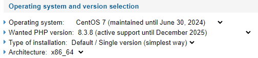
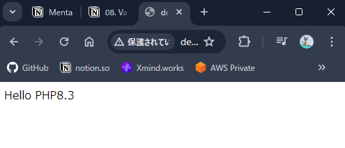

## Wordpress導入のためのOS/MW/SW準備

### PHPの導入/設定

- 参考
    
    - [[WordPress]php-fpmでstaticを利用してチューニングをしてみた](https://blog.adachin.me/archives/2317)

    - [RemiでCentOS7にPHP8をインストールする - Qiita](https://qiita.com/C_HERO/items/1512ba1e33c330c9ab0d)

1. Stable最新版php-fpmのインストール
    - 下記ページにアクセスし、OS情報、PHP version、インストールタイプを入力します。画像は、CentOS 7.2でStable最新版のphp-fpmをインストールする際の例です。
        
        [Remi's RPM repository](https://rpms.remirepo.net/wizard/)
        
        
        
    - 入力コマンドは上記情報を入力したのち、[**Wizard answer**]に表示されます。手順の概要を下記に記載します。
        
        ```bash
        # yum-utilsのインストール
        yum install yum-utils
        
        # 対象リポジトリの有効化
        yum-config-manager --disable 'remi-php*'
        yum-config-manager --enable   remi-php83
        
        # 有効化されているレポジトリのリストを表示します
        yum repolist
        
        # インストールパッケージの最新化
        yum update -y
        
        # PHPをインストール
        yum install -y php
        
        # PHPのバージョン確認
        php --version
        ```
        
2. php-fpmの設定ファイルをNginxで利用するための設定に修正します。
    
    ```bash
    vim /etc/php-fpm.d/www.conf
    ```
    
    ```bash
    # /etc/php-fpm.d/www.conf

    # リスナーを変更
    listen = /var/run/php-fpm/php-fpm.sock
    
    # user、groupをapacheから変更
    user = nginx 
    group = nginx
    
    # listen.owner、listen.groupのコメントアウトを外して値を修正
    listen.owner = nginx
    listen.group = nginx
    ```
    
3. php-fpmを起動して、OS起動時に自動起動するように設定を行います。
    
    ```bash
    systemctl start php-fpm
    systemctl enable php-fpm

    # enabledと表示されることを確認
    systemctl is-enabled php-fpm
    ```
    
4. PHPが使用できることを確認します。
    
    ```bash
    cd /var/www/dev.menta.me/
    echo "<?php echo 'Hello PHP7';" > index.php
    ```
    
    - ローカルPCのWebブラウザから`http://dev.menta.me/index.php` にアクセスを行い、PHPが問題なくブラウザに表示されていることを確認します。
        
        

5. php-fpmに明示的にメモリやプロセス数を割り当て、プロセス起動に伴うオーバーヘッドをなくす設定を行います。
    
    ```bash
    vim /etc/php-fpm.d/www.conf
    ```

    ```bash
    # /etc/php-fpm.d/www.conf

    pm = static
    pm.max_children = 50
    pm.start_servers = 50
    pm.min_spare_servers = 50
    pm.max_spare_servers = 50
    pm.process_idle_timeout = 10s;
    pm.max_requests = 100
    php_admin_value[memory_limit] = 256M
    request_terminate_timeout = 180
    ```
    
6. php-fpmの再起動を行います。
    
    ```bash
    systemctl restart php-fpm
    ```