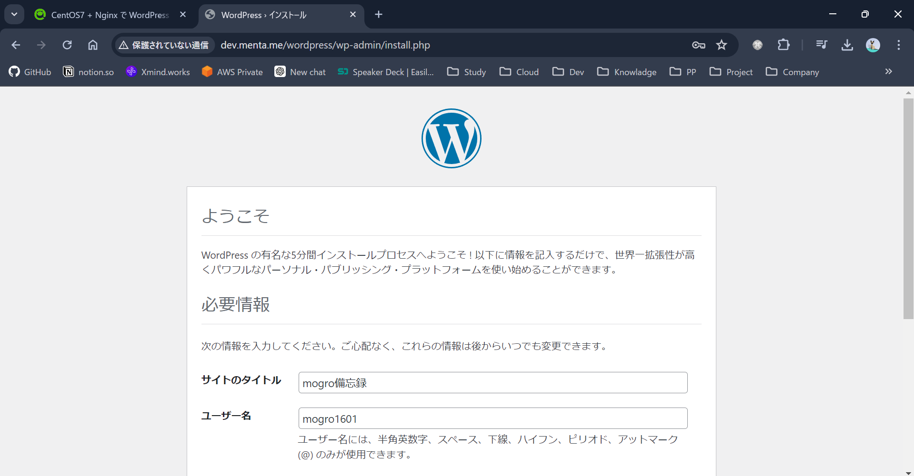

目次  
1. ローカル環境でのCentOS立ち上げ
   1. [ローカルPCセットアップ](./1_vagrant-setting.md)

2. Wordpress導入のためのOS/MW/SW準備
   1. [OSユーザー作成/公開鍵認証設定](./2-1_ssh-setting.md)
   2. [Nginxの導入/設定](./2-2_nginx-setting.md)
   3. [PHPの導入/設定](./2-3_php-setting.md)
   4. [MySQLの導入/設定](./2-4_mysql-setting.md)
   5. [Wordpress導入/設定](./2-5_wordpress-setting.md)
---

## Wordpress導入のためのOS/MW/SW準備

### Wordpress導入/設定
- 参考
    
    [CentOS7 + Nginx で WordPress をインストールする - Qiita](https://qiita.com/noraworld/items/69e5032d161b1e05978d)
    
1. Wordpressのインストールを行います。
    
    ```bash
    cd /var/www/dev.menta.me
    wget https://ja.wordpress.org/latest-ja.tar.gz
    tar xzf latest-ja.tar.gz
    rm latest-ja.tar.gz
    ```
    
2. バックアップを取得して、設定ファイルを修正します。なお、ランダムな文字列は下記URLを参考に取得し、設定ファイルに記載しています。
    
    [api.wordpress.org](https://api.wordpress.org/secret-key/1.1/salt/)
    
    ```bash
    cd wordpress
    cp -p wp-config-sample.php wp-config.php
    cp -p wp-config.php /vagrant/bk-config/
    vim wp-config.php
    ```
    
    ```bash
    # wp-config.php
    
    - define('DB_NAME', 'database_name_here');
    + define('DB_NAME', 'wordpress');
    
    - define('DB_USER', 'username_here');
    + define('DB_USER', 'menta');
    
    - define('DB_PASSWORD', 'password_here');
    + define('DB_PASSWORD', '上記DBユーザーのパスワード');
    
    - define('AUTH_KEY',         'put your unique phrase here');
    - define('SECURE_AUTH_KEY',  'put your unique phrase here');
    - define('LOGGED_IN_KEY',    'put your unique phrase here');
    - define('NONCE_KEY',        'put your unique phrase here');
    - define('AUTH_SALT',        'put your unique phrase here');
    - define('SECURE_AUTH_SALT', 'put your unique phrase here');
    - define('LOGGED_IN_SALT',   'put your unique phrase here');
    - define('NONCE_SALT',       'put your unique phrase here');
    + define('AUTH_KEY',         'ランダムな文字列');
    + define('SECURE_AUTH_KEY',  'ランダムな文字列');
    + define('LOGGED_IN_KEY',    'ランダムな文字列');
    + define('NONCE_KEY',        'ランダムな文字列');
    + define('AUTH_SALT',        'ランダムな文字列');
    + define('SECURE_AUTH_SALT', 'ランダムな文字列');
    + define('LOGGED_IN_SALT',   'ランダムな文字列');
    + define('NONCE_SALT',       'ランダムな文字列');
    ```
    
3. 設定ファイルのPATHにブラウザからアクセスを行います。
    
    [http://dev.menta.me/wordpress/wp-config.php](http://dev.menta.me/wordpress/wp-config.php)
    
4. ウェルカムページで必要情報の設定を行います。
    
    
    
5. 下記URLにアクセスを行い、サンプルページが観覧できることを確認します。
    
    [http://dev.menta.me/wordpress/](http://dev.menta.me/wordpress/)